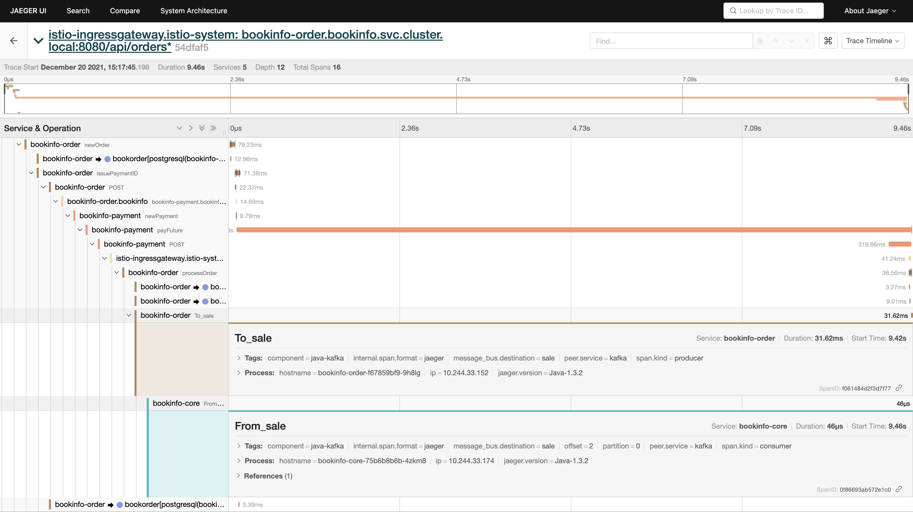
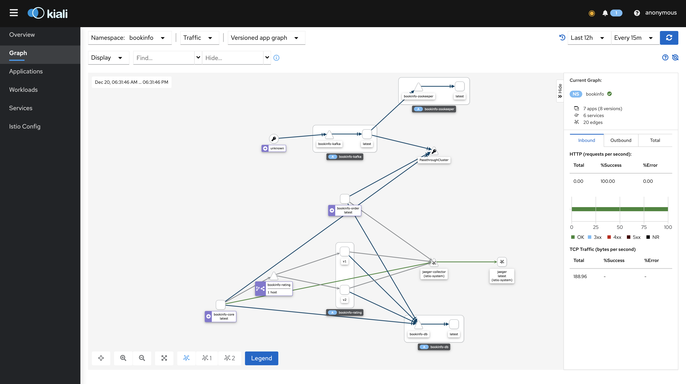

# MSA SAMPLE PROJECT

## 프로젝트 구조

  
    
    
	
    

  
    
    
	<ul align="left" style="list-style-type:none;">관련 링크
        <li align="left"><A href = "https://github.com/tmax-cloud/bookinfo-common" >[repo] BOOKINFO-Common</A></li>
        <li align="left"><A href = "https://github.com/tmax-cloud/bookinfo-order" >[repo] BOOKINFO-Order</A></li>
        <li align="left"><A href = "https://github.com/tmax-cloud/bookinfo-rating" >[repo] BOOKINFO-rating</A></li>
        <li align="left"><A href = "https://github.com/tmax-cloud/bookinfo-payment" >[repo] BOOKINFO-payment(external)</A></li>
        <li align="left"><A href = "docs/springboot_guide.md" >스프링부트 개발 가이드</A></li>
        <li align="left"><A href = "docs/istio.md" >istio 설정</A></li>        
        <li align="left"><A href = "docs/API_doc.md" >API Docs</A></li>
        <li align="left"><A href = "docs/install.md" >install guide</A></li>
    </ul>
    

|                 JAEGER UI                  |                 kiali UI                  |
| :----------------------------------------: | :---------------------------------------: |
|  |  |

